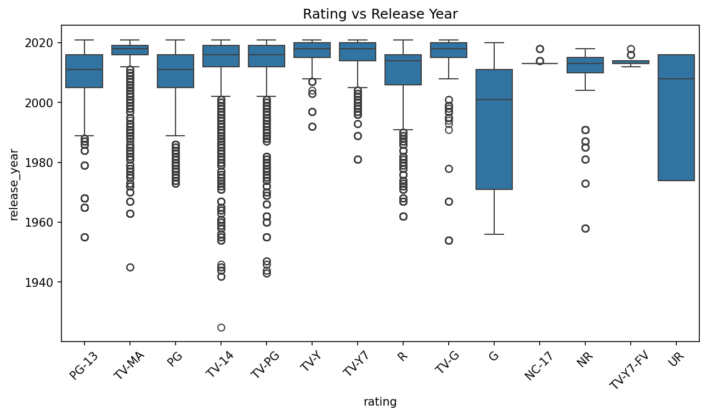
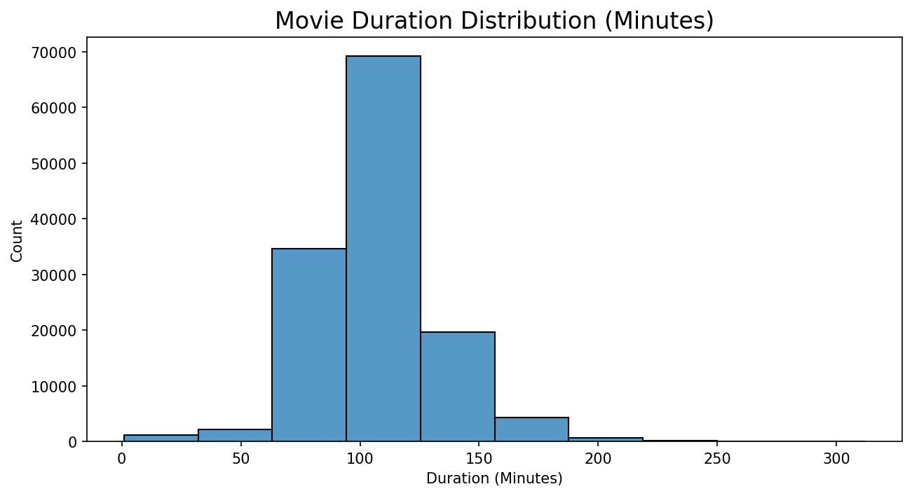

# Netflix Content EDA - What should Netflix produce next?

  

---

## What this project is about

I cleaned messy Netflix data, fixed bugs I stumbled into along the way, and pulled out business insights using Python.

The dataset has 8,807 titles across 123 countries. The goal was simple:

**What type of content should Netflix focus on — and where should it grow next?**

This is my first solo end-to-end data project, built after transitioning from 3.4 years in healthcare data analytics.

---

## Dataset

| Property | Detail |
|---|---|
| Source | [Kaggle — Netflix Movies and TV Shows](https://www.kaggle.com/datasets/shivamb/netflix-shows) |
| Rows | 8,807 titles |
| Columns | 12 |
| Period covered | 1925 – 2021 |

---

## Data cleaning — the hardest part

Columns like `country`, `cast`, and `listed_in` stored multiple values in a single cell. One title could have `"India, United States, United Kingdom"` all crammed into the country column.

This took the most time to get right. Here's the 3-step process I used:

```python
# Step 1 — split the string into a list
df['country'] = df['country'].str.split(',')

# Step 2 — explode: each value becomes its own row
df = df.explode('country')

# Step 3 — remove extra spaces
df['country'] = df['country'].str.strip()
```

> **Note on row counts:** After exploding, the total rows go above 8,807. That's expected — each row now represents one country/genre *appearance*, not one unique title. So when I report country counts, I'm counting appearances, not distinct titles.

---

## A bug I found mid-analysis

While doing a boxplot of Rating vs Release Year, I saw something weird in the x-axis — `"66 min"`, `"74 min"`, `"84 min"` appearing as ratings. 😳

Duration values had accidentally ended up in the rating column.

I fixed it by keeping only valid rating categories:

```python
valid_ratings = ['TV-MA','TV-14','R','PG-13','PG','G','TV-Y','TV-Y7','TV-G','NR','NC-17']
df_clean = df[df['rating'].isin(valid_ratings)]
```

Lesson learned: **always visualize before you analyze.** Dirty data hides in places you'd never expect.



---

## What I found

- Movies dominate Netflix at ~70% — but TV Shows are growing faster, especially post-2016
- Most content was added between 2018–2020, with a noticeable dip after 2020 (likely COVID impact on production)
- The US leads content production by a wide margin. India is #2 and closing the gap fast
- TV-MA and TV-14 are the top ratings — Netflix is clearly targeting mature audiences
- Drama and International Movies are the most common genres globally
- July and December see the highest content additions every year



---

## Business recommendations

1. **Invest more in TV Shows** — they bring viewers back across multiple episodes and seasons, which is better for retention than one-off movies
2. **India is the biggest untapped opportunity** — 1.4 billion people, rising internet users, and most Indian content is still Bollywood-focused. Regional originals in Tamil, Telugu, and Marathi are underserved
3. **Drama and Thriller are safe bets** — consistently the highest-demand genres across countries
4. **Release big content in July and December** — that's when additions peak, suggesting those months drive the most engagement
5. **Mature content is Netflix's core identity** — TV-MA dominates across all markets; doubling down on premium adult drama makes sense

---

## Tools used

`Python` · `Pandas` · `NumPy` · `Matplotlib` · `Seaborn`

---

## About me

6 months ago I was a Drug Safety Analyst. Today I'm building data projects from scratch.

I spent 3.4 years working in healthcare data at Cognizant and Indegene — always working *with* data, but never truly analyzing it independently. In May 2025, I left my job, joined Scaler's Data Science program full-time, and started building real projects.

This Netflix EDA is my first. Every bug I fixed taught me something new.

📧 ashwinisonawane693@gmail.com · 💼 [LinkedIn](http://www.linkedin.com/in/ashwini-sonawane-3294aa196) · 🐙 [GitHub](https://github.com/ashusonawane24398-cyber/Netflix-data-analysis)


